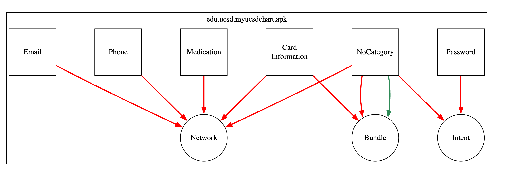
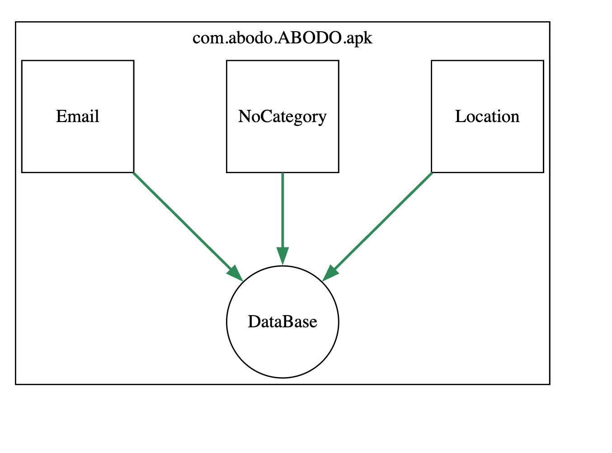

**Personal Information Tracker (PIT) - Static Analysis Tool for Android**

**Overview**  
**Personal Information Tracker (PIT)** is a static analysis tool for Android applications designed to detect personal information leaks from View objects such as `EditText`, `RadioButton`, `CheckBox`, and `Spinner`. It utilizes **FlowDroid** for taint tracking to trace information flows from sources (e.g., `getText()`, `isChecked()`) to sinks such as **Network**, **File**, **Database**, or **Logs**.

**Key Feature**  
PIT identifies the specific **View object** associated with each leak, making it a pioneer in detecting GUI-based information leaks in Android applications.

**Related Research Papers:**  
- [Towards Precise Detection of Personal Information Leaks in Mobile Health Apps](https://arxiv.org/abs/2410.00277)  
- [A STUDY OF PERSONAL INFORMATION LEAKS IN MOBILE MEDICAL, HEALTH, AND FITNESS APPS](https://www.iadisportal.org/ijwi/papers/2024220207.pdf)  

---

**Usage Instructions**  
**Download the Tool:** Use the latest version from the **Releases section** or the `released/` directory.

**Run Command:**  
```bash
java -jar PIT-all-1.0-SNAPSHOT.jar apkDir apkCompleteDir ResultDir DB 2200 platforms
```

**Arguments Explanation:**  
- **Arg 1:** `apkDir` – Directory with APKs for analysis.  
- **Arg 2:** `apkCompleteDir` – Directory for analyzed APKs.  
- **Arg 3:** `ResultDir` – Directory for results.  
- **Arg 4:** Analysis Type:  
  - `DB`: Database sinks  
  - `Net`: Network sinks  
  - `Log`: Log sinks  
  - `File`: File/IO sinks  
  - `Heavy`: Full analysis (128GB+ RAM required)  
  - `Light`: Lightweight analysis  
- **Arg 5:** Timeout (in seconds) – e.g., `2200` for complex analysis.  
- **Arg 6:** Android SDK `platforms/` directory path.  

---

**Outputs:**  
Two output files are saved in `ResultDir`:  
1. **`<APKName>_result.txt`** – Detailed leak information:  
```plaintext
Source: virtualinvoke $r2.<android.widget.AutoCompleteTextView: android.text.Editable getText()>()
Sink: interfaceinvoke $r2.<android.content.SharedPreferences$Editor: android.content.SharedPreferences$Editor putBoolean()>($r3, $z0)
SootField: <com.abodo.ABODO.FiltersActivity: android.widget.AutoCompleteTextView d>
viewIDs: actv_filters_location_input
Party: First_Party_Only
```
2. **`<APKName>_dotCode.txt`** – DOT graph file for visualization ([Graphviz Online](https://dreampuf.github.io/GraphvizOnline)).
   
***Output Figures from Graphviz***

-   

- 

---

**Reference (Citation):**  
```bibtex
@article{ardalani2024study,
  title={A STUDY OF PERSONAL INFORMATION LEAKS IN MOBILE MEDICAL, HEALTH, AND FITNESS APPS.},
  author={Ardalani, Alireza and Antonucci, Joseph and Neamtiu, Iulian},
  journal={IADIS International Journal on WWW/Internet},
  volume={22},
  number={2},
  year={2024}
}

